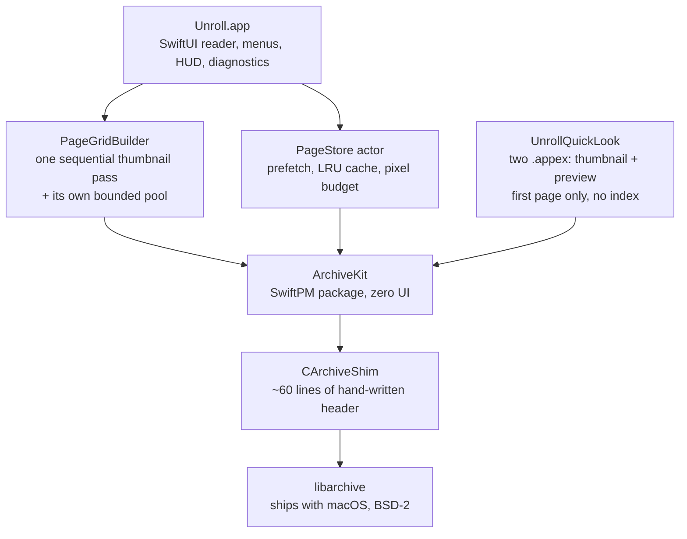

**English** | [简体中文](ARCHITECTURE.zh-CN.md)

# Architecture

Unroll is small enough to read in an afternoon, but a handful of decisions carry most of the weight. This document records them: the problem, the alternatives that were considered, and why this one won. Numbers here are measured, not estimated — the full methodology lives in [`docs/测试与验证.md`](docs/测试与验证.md) (Chinese).

## Layers

The split is not cosmetic. `ArchiveKit` knows nothing about SwiftUI, AppKit or the reader's needs, so it can be reused as-is by an iOS or iPadOS build — and it is tested on its own, without launching an app. The Quick Look extensions go straight to `ArchiveKit` too, skipping `PageStore` entirely: `PageStore` exists to prefetch and cache *consecutive* pages, which is exactly what a thumbnail provider must not do. The thumbnail grid skips `PageStore` for the same reason from the opposite direction — it needs a *whole-document* sweep with no eviction, which is precisely what a consecutive-page cache is not (Decision 7).

| Layer | Responsibility | Depends on |
| --- | --- | --- |
| `Unroll.app` | Views, menus, keyboard, HUD, recents, crash diagnostics | `PageStore` |
| `PageGridBuilder` | One sequential pass over the whole archive, downsampling each page; a bounded pool that **stops** at the ceiling instead of evicting | `ArchiveKit` |
| `UnrollQuickLook` | Two Quick Look extensions: read page 1 within a pixel budget, report encrypted / unreadable honestly | `ArchiveKit` |
| `PageStore` | Prefetching (±2 pages), cache eviction, decode scheduling | `ArchiveKit` |
| `ArchiveKit` | Format detection, natural sort, sequential page reading | `CArchiveShim` |
| `CArchiveShim` | Bridges the `archive.h` that the macOS SDK does not export | `libarchive` |

---

## Decision 1 — System `libarchive`, not a bundled library

**The problem.** The reader has to handle ZIP, 7z, TAR and RAR. All four are non-trivial formats, and the worst of them (7z, with solid compression and LZMA2) is a project in itself.

**Alternatives considered.** `ZIPFoundation` covers only ZIP. `SWCompression` is pure Swift and covers more, but it is slower, and RAR support is not there. `XADMaster` is GPL and effectively unmaintained. Writing a fourth archiver was never on the table.

**What was chosen.** The `libarchive` that already ships inside macOS. It is BSD-2 licensed, handles every format in scope, and — because it is part of the OS — costs nothing in binary size or supply-chain surface.

**The catch, and how it is handled.** Apple's SDK does not export `archive.h`. Rather than shipping a copy of the library, the project carries a ~60-line hand-written header (`CArchiveShim`) that declares only the functions actually used. That keeps the dependency at "the OS we already target" while staying honest about what is being called.

**Consequence worth knowing.** Behaviour follows the *system* library version, not ours. The encryption handling below is a direct example: encrypted 7z cannot be decrypted at all, because the shipped `libarchive` does not support it. The app says so plainly instead of asking for a password that could never work.

## Decision 2 — One sequential scanner, never a reopen per page

**The problem.** Archive formats are streams, not random-access files. The obvious implementation — open the archive, jump to page N, read it, close — is fine for ZIP and catastrophic for solid 7z, where page N cannot be decoded without first decoding every page before it.

**Measured.** On a 200-page solid 7z archive, the reopen-per-page approach is **71× slower by page 150**, and the ratio grows as the archive does. It is O(n²) in archive size, so it gets worse exactly when the user would notice most.

**What was chosen.** A single `SequentialPageReader` walks the archive once, in order, handing pages out as it goes. Page 200 costs roughly what page 1 costs.

**The trade-off.** Going *backwards* to a page the reader has already passed means starting the scan over. That is paid for by the cache below — and it is strictly better than O(n²), because the backward case is bounded by archive size rather than being multiplicative.

**Concurrency constraint.** `libarchive`'s `struct archive` is not thread-safe, so each reader instance is exclusively owned; readers are never shared across tasks. This is enforced by making the reader an actor with no shared state.

## Decision 3 — A cache measured in pixels, and eviction that demotes instead of dropping

**The problem.** A 4000×6000 scanned page decodes to roughly 96 MB in RGBA. Twenty pages of that is 2 GB — more than the machine has to spare, and it happens within a single minute of ordinary reading.

**What was chosen.** `PageCache` keeps at most **8 full-resolution pages** and **200 M pixels in total**, whichever binds first. Eviction is not a plain drop: an evicted page is re-rendered down to a 1600 px thumbnail and kept. Scrolling back through a few pages then costs a cheap upscale rather than a full decode.

**The subtlety that cost real debugging time.** For an image decode, "trimmed" is not the same as "released". `CGImage` can be marked trimmed while its backing buffer is still alive, so memory measured by allocation size *looks* fine while `phys_footprint` keeps climbing. Every memory assertion in this project samples `phys_footprint`, not allocation totals — the automated benchmark does it once per page for exactly this reason.

## Decision 4 — Sandboxed, with bookmarks that stay inert at launch

**The problem.** Under App Sandbox, file access is granted per-launch. Restart the app and the archive you were reading is unreachable again — which would make "Recent documents" impossible.

**What was chosen.** Security-scoped bookmarks (`bookmarkData(options: .withSecurityScope)`), stored in `UserDefaults`, with `com.apple.security.files.bookmarks.app-scope`. Only the **file name** is stored alongside; no path is ever persisted.

**The part that is easy to get wrong.** Resolving a bookmark can have side effects: it may mount a network volume, or raise an authorisation prompt, or both. Doing that during a *launch-time staleness check* would mean the app quietly reaching for a remote server — or throwing a dialog in the user's face — before they asked for anything.

So the two paths are deliberately different:

| Path | What it may do | When |
| --- | --- | --- |
| `unresolvableIDs()` — launch-time staleness probe | Resolves **without mounting and without UI**. Read-only; it does not even refresh stale bookmarks, and never removes anything. | App launch, and after opening a file |
| `resolve()` — actually opening an entry | May mount, may prompt. That is fine: the user just clicked it. | On click |

A failure in the probe is therefore advisory, never destructive: the menu item is *labelled* ("file not found") but stays until the user actually clicks it and the open fails. Probing separates "this looks broken" from "remove this", which is also what makes the two testable independently.

## Decision 5 — Diagnostics that cannot leak a path by construction

**The problem.** When an app quits unexpectedly, the user is the only one who knows. A bug report needs enough context to be actionable, and an archive reader's context is *file names* — which, for a comic archive, is frequently the content itself.

**The constraints.** Zero backend. Zero automatic uploads. Zero operating cost. And the app has no network entitlement at all, so "upload" is not a policy promise but a sandbox impossibility.

**What was chosen.** A breadcrumb ring buffer (20 entries, appended to a JSON Lines file in real time, truncated at 4 KB) plus an abnormal-exit self-check. On the next launch the user is asked **once**; if they accept, the app opens a pre-filled GitHub issue draft in their browser. The app itself still makes no network request — the browser does, and the user can read and edit everything before submitting.

**The privacy mechanism is structural, not filtering.** The obvious approach is to log events and strip paths out afterwards. That is a blocklist, and blocklists leak: one missed branch and a filename escapes. Instead, breadcrumb *values* are validated against a whitelist — `[A-Za-z0-9_-:]{1,24}` — at write time. A path cannot be represented in that alphabet, so it cannot get in, whether or not anyone remembered to filter it. What does get recorded is buckets and error codes: page-range buckets, layout mode, direction, fit mode, error kinds. Never a file name.

---

## Decision 6 — Two Quick Look extensions, sharing source rather than a framework

**The problem.** An archive reader that only reveals itself after you open it is invisible in Finder. The single highest-leverage visibility feature is showing the archive's own cover as the file icon and in the `Space` preview — no app launch, no library, no import step.

**The constraint.** macOS allows exactly **one** extension point per `.appex`. Thumbnails (`com.apple.quicklook.thumbnail`) and previews (`com.apple.quicklook.preview`) are two different extension points, so two targets are mandatory — there is no single-extension design available.

**What was chosen.** Two appex targets, both embedded in `Contents/PlugIns/`, both signed inner-to-outer before the app itself. The page-reading logic lives in `UnrollQuickLook/Shared/` and is **compiled into both targets** rather than extracted into a shared framework — a few hundred bytes of duplication is a better trade than a third binary to sign, version and validate.

**Three decisions inside the extensions matter more than the plumbing:**

- **First page only, no index.** Finder calls a thumbnail provider dozens of times for one window full of files. Anything resembling a full archive scan is off the table, and `SequentialPageReader` — the single streaming scanner the reader uses — is deliberately *not* used here, because it is built for consecutive paging, not one-shot reads.
- **A pixel budget on the way out.** The first page of a scanned volume can be 4000×6000. Decoding it at full size to draw a Finder icon wastes tens of megabytes per file, so decoding goes through ImageIO's thumbnail path, with the EXIF transform applied — a "comic" made of phone photos is otherwise sideways.
- **Failure returns *nothing*, on purpose.** The result is a three-state enum (`page` / `encrypted` / `unreadable`), and the thumbnail provider answers `(nil, nil)` for both failure states. That is Quick Look's legitimate "this extension produces no thumbnail" signal, and Finder falls back to its generic icon. Drawing a lock badge on every encrypted archive was considered and rejected: it carries less information than the default icon, and it makes a perfectly fine archive look broken. The preview panel, which the user explicitly asked for, is the place where encrypted and damaged are told apart.

Only `cbz / cbr / cb7 / cbt` are claimed. Bare `.zip` is deliberately excluded even though the app can read it: claiming it would route every ordinary ZIP in the system through a comic reader that will show "cannot preview" for most of them.

## Decision 7 — The thumbnail grid inverts Decision 3's eviction policy, on purpose

**The problem.** Every navigation shortcut the app had assumed the reader already knew where they were going: `⌥⌘G` takes a page number, `⌘D` marks one, `⇧⌘↑↓` go to the ends. Finding "that two-page spread, somewhere in the middle" meant paging through and recognising it. The grid is the first feature that answers a question the others cannot.

**Why the obvious implementation is quadratic.** A grid is used by *random* access — scroll to the end, then back to the start. But `SequentialPageReader` only moves forward (Decision 2): reading page *k* means closing the handle, reopening, and walking *k* headers. "Generate thumbnails as they scroll into view" therefore turns one pass through the grid into **O(n²)** — the same trap Decision 2 exists to avoid, reached from a different direction.

**What was chosen.**

| Choice | Reason |
| --- | --- |
| **One sequential pass**, in document order | Total cost is pinned to O(n) regardless of how the user scrolls. The trade is that *when* a given page becomes visible is decided by scan progress, not by scrolling. |
| **Budget stops generation; it does not evict** | This is the deliberate inversion of Decision 3. Evicting a grid thumbnail means some page the user scrolls back to needs a random-access re-read — which is exactly the quadratic cost the sequential pass just eliminated. Stopping at the ceiling has no bad branch; silently degrading does. |
| **A third, independent pool** | Grid thumbnails (256 px long edge) and `PageCache`'s demoted thumbnails (1600 px) differ by an order of magnitude. Sharing one budget lets either starve the other. Constants live in `DesignSystem.PageBudget`. |
| **Render path does no I/O** | The view only queries the pool. Scrolling can never pull a disk read into drawing. |

**Why Decision 3's policy is still right for `PageCache`.** The two caches differ because their *access patterns* differ, not because one of them is wrong. `PageCache` serves previous/next paging — a near-linear walk, where dropping a page and re-reading it a few pages later is cheap and bounded. The grid serves whole-document random access, where any eviction can cost a full rescan at an arbitrary moment. Same building, opposite rules; the rule has to follow the access pattern.

**The subtlety worth remembering.** The scan thread writes thumbnails into the pool **synchronously** under a lock, rather than hopping back to the main actor once per image. The first design spawned one task per page — which both manufactured N tasks and left a window where the build had *reported* completion while the pool was still empty (visible to users as "the progress bar finished but the pictures are not there yet"). Because the writer is now off the main actor, per-generation isolation can no longer be a flag: **each generation gets its own pool object**, so a late write from a scan of the previous archive lands in a pool nobody reads.

**Honest note on verification.** The algorithm and view-model layers are covered by 20 unit tests, including the two failure-classification rules (an encrypted page is *skipped*, not *damaged*; a decode failure does not reopen the scanner, while a byte-read failure must). This paragraph used to claim that **the panel's appearance in a real window has no automated evidence** — **that claim expired on 2026-09-20 and has been retracted**: a **DEBUG-only in-app driver** (`DemoDriver`, where the marker file's name is the scene name) now opens the panels itself, and `verify-ui.sh`'s `ONLY=grid` / `ONLY=jump` passes record 5 structured assertions plus a screenshot (5 as of 2026-09-20, when this was written; **8** as of 2026-09-23 — `ONLY=grid` alone now carries 5, the added one asserting the window really returned to the grid layer, `layer=browse`). Injecting keystrokes from outside the app is **still** refused by the accessibility TCC boundary — which is precisely *why* the app has to drive itself, not a reason for having no evidence. What remains unverified is feel only: generation speed, and the `budgetReached` wording (needs a 600+ page sample to trigger).

## Decision 8 — Bulk export traversal lives in the kit; naming and writing do not

**The problem.** `⇧⌘E` walks every page in reading order and hands out its **raw bytes**. The two things most likely to break silently are the order (an archive's physical order is not reading order — `plain.cbz` stores `page10` before `page1`) and the bytes (a stray decode/re-encode would break "get the source material out" with no symptom at all, because the images would still look fine).

**Why the loop is not in the app layer.** Asserting those two things needs the repository fixtures, and the app-hosted test target runs **inside the sandbox**, where it may not be able to read them at all (`PageStoreTests` and `IntegrityCheckTests` both carry skip branches for exactly this). Inside `ArchiveKit`, `swift test` runs unsandboxed and can compare the delivered bytes against the fixture byte for byte.

**So the split is:** `PageSequenceExtractor` in the kit (traversal, encryption/damage classification, cancellation, bounded reopening — the same skeleton as `ArchiveIntegrityChecker`, and it writes no files), while the app layer only names files and writes them. A failed write comes back as `onPage` returning false, which the kit reports as `.sinkStopped` — deliberately distinct from damage, so the panel can say "the write failed" instead of blaming the archive.

**And the output path never touches the entry name.** A file is `<archive>-p003.png`: archive name, zero-padded page number, extension. Nothing else — no directory reconstruction, no timestamps, no permission bits, no symlinks. That is a safety property rather than a shortcut: zip-slip cannot happen, because entry names are never used as paths.

---

## What was deliberately not built

An architecture is partly defined by its refusals. Each of these was considered and rejected, not overlooked:

| Not built | Why |
| --- | --- |
| Library / cover wall / metadata | That is YACReader's territory. Building it would trade away the "lightweight" positioning for a feature set that is already solved elsewhere. |
| Password entry for **7z**, and any password *store* | The shipped `libarchive` cannot decrypt 7z at all — the identical failure comes back whether or not a password is supplied, so a box there could never succeed. 7z gets an explanation instead of a prompt. ZIP (ZipCrypto / AES) and RAR *do* get an entry (added in v1.1, `⇧⌘K`, plus a button on each encrypted placeholder card); the passphrase lives in memory only and is never written to disk. |
| L1/L2 crash reporting (Sentry, self-hosted, silent upload) | Incompatible with "zero operating cost" and with an app that has no network entitlement by design. |
| Custom `signal` handlers for crash capture | Fragile, and the payoff over the abnormal-exit self-check is small relative to the risk of making a crash worse. |
| Extracting archives to disk **as the way to read them** | The entire premise. Extraction is what this app exists to avoid. Note the distinction from `⇧⌘E` (export every page), added in v1.1: that one *is* an explicit, user-requested write of page files — but it is not extraction. It writes a flat set named after the archive and a zero-padded page number, in reading order, and restores nothing else (no directory tree, no timestamps, no permission bits, no symlinks). For that reason it also cannot zip-slip: entry names are never used as paths. |
| iOS / iPadOS build (v1) | A second product, not a port. `ArchiveKit` is kept UI-free specifically so this stays possible later without a rewrite. |
| Paging inside the Quick Look preview panel | That means rebuilding the reader inside a panel that does not accept keyboard events and that the host reclaims on a timeout. The preview shows the cover and the page count; reading stays in the app. |
| A placeholder thumbnail for encrypted / unreadable archives | A lock badge on every encrypted archive carries less information than Finder's default icon, and implies the archive itself is at fault. Falling back to the system icon is the honest answer. |

## Testing shape

The suite is split by what it needs to run, so that fast feedback stays fast:

| Target | Launch an app? | Count | Covers |
| --- | --- | --- | --- |
| `ArchiveKit` (SwiftPM) | No | 78 | Format handling, natural sort, sequential reads, integrity scanning, bulk page traversal, byte-exact fixture comparisons |
| `UnrollLogicTests` | No | 6 | The reader's contract against `ArchiveKit`, run in milliseconds |
| `UnrollQuickLookTests` | No | 11 | The Quick Look extensions' page-reading logic: first-page selection, downsampling limits, and the full failure-state mapping |
| `UnrollTests` (app-hosted) | Yes | 242 | View model logic, layout/direction (including the continuous-scroll viewport/page-number link and its active-row window), progress and bookmark persistence, recents, localisation keys, menu/shortcut guards, the thumbnail grid's scan-and-budget rules plus its two-layer navigation with the reader (opening an archive lands on the grid, `Esc` returns to it, and an in-flight scan is neither restarted nor cancelled by layer switches), the bulk-export glue (naming, on-disk order, write-failure mapping), the memory-budget invariants themselves, the one-shot reading-tip marker (asserted to be a single boolean), and the recents presentation + shortcut catalogue that the menu, the welcome screen and the Help panel all share, plus the reader-chrome / window-layout invariants (dimming never fully hides the way back, arrow hit targets keep the HIG minimum, and the thumbnail rail never squeezes the canvas below the old minimum window) |

337 cases / 335 passing / 2 skipped as of 2026-09-23 (the skips are the external-sample and synthetic-benchmark cases, both opt-in). Counts are de-duplicated by test name — the raw log prints two lines per case. Running the whole suite under the **Release** configuration is impossible by design: `ArchiveKitTests` uses `@testable import`, which needs `-enable-testing` (Debug only), so the Release half of the no-warnings standard is a full **build**, not a test run.

One boundary is worth stating explicitly, because it is a real gap rather than an oversight: the extensions' **logic** is covered above, but **whether the system actually calls them** cannot be verified headlessly — an `.appex` is launched on demand by Quick Look, and in a restricted environment even `pluginkit -m` is refused and `qlmanage` cannot run. What *is* checked automatically is static correctness (extension point, architectures, nested signature, claimed UTIs). The end-to-end step is delegated to `Scripts/verify-quicklook.sh`, which must be run in a normal login session.

Reader-facing UI has its own automated pass. `Scripts/verify-ui.sh` operates the window through a **DEBUG-only in-app driver**, because the shortcuts that would otherwise open those panels (`⇧⌘G` / `⌥⌘G`) cannot be injected from outside — accessibility TCC refuses synthetic keystrokes. The driver writes a structured status line and a screenshot, so the check is deliberately two-layered: **the log proves the data, the image proves the layout**, and neither alone would catch both classes of error. That pass runs against a **DEBUG build**, not the shipped binary. The bulk-export panel (`⇧⌘E`) **joined that pass on 2026-09-22** (`ONLY=export`; see the test document's §18.5). Its behaviour was already covered by unit tests (order, bytes, write-failure mapping); the new pass adds what those cannot see — the panel's layout in a real window, plus a **report-versus-disk** check: what the report says it wrote, versus how many files the driver finds on disk, versus the script counting that same directory a third time. Two things it still does **not** cover: the mid-run frame (the *Stop* button's placement — 30 pages take 200 ms, so the screenshot race cannot be won) and the `NSOpenPanel` directory-picking step, which the driver deliberately bypasses.

The first-read tip bar joined that pass on the same day (`ONLY=hint`). Its assertion is deliberately thin — a single field, `visible=1` — because "the bar is on screen" and "it appeared on its own" **cannot be told apart after the fact**: the one-shot marker and the display are written by the same synchronous block. So the driver records `markerAtAppear` (the store at launch) and the per-open `didAutoShowHintBar` flag rather than trusting the marker. Whether the bar **covers** the page is not measured at all — it is a row in the layout and the page gets the height that remains, so that property holds by construction rather than by measurement.

Part of the image evidence is now machine-read too, via `Scripts/page_metrics.swift`. That became necessary because **"fits the width" and "fits the width but is clipped" are pixel-identical to the eye**: the continuous-scroll rows used to take their width from an outer `GeometryReader` (900 pt) while the scroll view's content area was 885 pt — the system reserves a 15 pt gutter for legacy scroll bars whenever "Always show scroll bars" is on — so every page lost 7.5 pt on each side. The probe measures the fixture's own page-footer progress bar, whose width is a known fraction of the page, and asserts it against the measured content width. Screenshots still carry what only a human can judge (does the crash prompt read too harshly, does the empty state look composed).

Fixtures are generated by a script, are deterministic, and are committed — so "byte-exact page comparison" means the same bytes on every machine. Regenerating them is a script run plus a test run; see [`docs/测试与验证.md`](docs/测试与验证.md) (Chinese).
