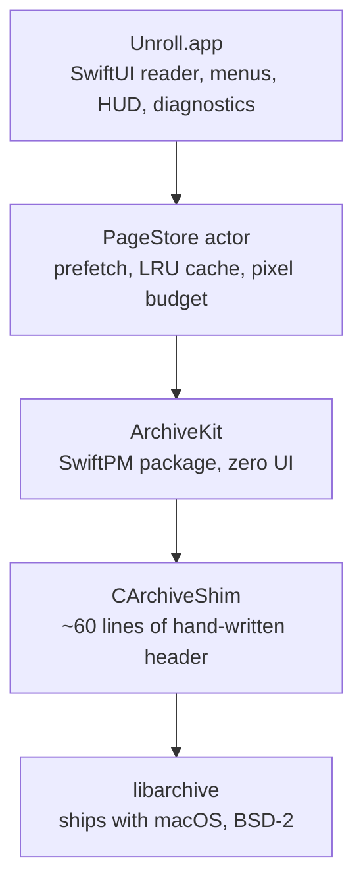

# Architecture

Unroll is small enough to read in an afternoon, but a handful of decisions carry most of the weight. This document records them: the problem, the alternatives that were considered, and why this one won. Numbers here are measured, not estimated — the full methodology lives in [`docs/测试与验证.md`](docs/测试与验证.md).

## Layers

The split is not cosmetic. `ArchiveKit` knows nothing about SwiftUI, AppKit or the reader's needs, so it can be reused as-is by an iOS or iPadOS build — and it is tested on its own, without launching an app.

| Layer | Responsibility | Depends on |
| --- | --- | --- |
| `Unroll.app` | Views, menus, keyboard, HUD, recents, crash diagnostics | `PageStore` |
| `PageStore` | Prefetching (±2 pages), cache eviction, decode scheduling | `ArchiveKit` |
| `ArchiveKit` | Format detection, natural sort, sequential page reading | `CArchiveShim` |
| `CArchiveShim` | Bridges the `archive.h` that the macOS SDK does not export | `libarchive` |

---

## Decision 1 — System `libarchive`, not a bundled library

**The problem.** The reader has to handle ZIP, 7z, TAR and RAR. All four are non-trivial formats, and the worst of them (7z, with solid compression and LZMA2) is a project in itself.

**Alternatives considered.** `ZIPFoundation` covers only ZIP. `SWCompression` is pure Swift and covers more, but it is slower, and RAR support is not there. `XADMaster` is GPL and effectively unmaintained. Writing a fourth archiver was never on the table.

**What was chosen.** The `libarchive` that already ships inside macOS. It is BSD-2 licensed, handles every format in scope, and — because it is part of the OS — costs nothing in binary size or supply-chain surface.

**The catch, and how it is handled.** Apple's SDK does not export `archive.h`. Rather than shipping a copy of the library, the project carries a ~60-line hand-written header (`CArchiveShim`) that declares only the functions actually used. That keeps the dependency at "the OS we already target" while staying honest about what is being called.

**Consequence worth knowing.** Behaviour follows the *system* library version, not ours. The encryption handling below is a direct example: encrypted 7z cannot be decrypted at all, because the shipped `libarchive` does not support it. The app says so plainly instead of asking for a password that could never work.

## Decision 2 — One sequential scanner, never a reopen per page

**The problem.** Archive formats are streams, not random-access files. The obvious implementation — open the archive, jump to page N, read it, close — is fine for ZIP and catastrophic for solid 7z, where page N cannot be decoded without first decoding every page before it.

**Measured.** On a 200-page solid 7z archive, the reopen-per-page approach is **71× slower by page 150**, and the ratio grows as the archive does. It is O(n²) in archive size, so it gets worse exactly when the user would notice most.

**What was chosen.** A single `SequentialPageReader` walks the archive once, in order, handing pages out as it goes. Page 200 costs roughly what page 1 costs.

**The trade-off.** Going *backwards* to a page the reader has already passed means starting the scan over. That is paid for by the cache below — and it is strictly better than O(n²), because the backward case is bounded by archive size rather than being multiplicative.

**Concurrency constraint.** `libarchive`'s `struct archive` is not thread-safe, so each reader instance is exclusively owned; readers are never shared across tasks. This is enforced by making the reader an actor with no shared state.

## Decision 3 — A cache measured in pixels, and eviction that demotes instead of dropping

**The problem.** A 4000×6000 scanned page decodes to roughly 96 MB in RGBA. Twenty pages of that is 2 GB — more than the machine has to spare, and it happens within a single minute of ordinary reading.

**What was chosen.** `PageCache` keeps at most **8 full-resolution pages** and **200 M pixels in total**, whichever binds first. Eviction is not a plain drop: an evicted page is re-rendered down to a 1600 px thumbnail and kept. Scrolling back through a few pages then costs a cheap upscale rather than a full decode.

**The subtlety that cost real debugging time.** For an image decode, "trimmed" is not the same as "released". `CGImage` can be marked trimmed while its backing buffer is still alive, so memory measured by allocation size *looks* fine while `phys_footprint` keeps climbing. Every memory assertion in this project samples `phys_footprint`, not allocation totals — the automated benchmark does it once per page for exactly this reason.

## Decision 4 — Sandboxed, with bookmarks that stay inert at launch

**The problem.** Under App Sandbox, file access is granted per-launch. Restart the app and the archive you were reading is unreachable again — which would make "Recent documents" impossible.

**What was chosen.** Security-scoped bookmarks (`bookmarkData(options: .withSecurityScope)`), stored in `UserDefaults`, with `com.apple.security.files.bookmarks.app-scope`. Only the **file name** is stored alongside; no path is ever persisted.

**The part that is easy to get wrong.** Resolving a bookmark can have side effects: it may mount a network volume, or raise an authorisation prompt, or both. Doing that during a *launch-time staleness check* would mean the app quietly reaching for a remote server — or throwing a dialog in the user's face — before they asked for anything.

So the two paths are deliberately different:

| Path | What it may do | When |
| --- | --- | --- |
| `unresolvableIDs()` — launch-time staleness probe | Resolves **without mounting and without UI**. Read-only; it does not even refresh stale bookmarks, and never removes anything. | App launch, and after opening a file |
| `resolve()` — actually opening an entry | May mount, may prompt. That is fine: the user just clicked it. | On click |

A failure in the probe is therefore advisory, never destructive: the menu item is *labelled* ("file not found") but stays until the user actually clicks it and the open fails. Probing separates "this looks broken" from "remove this", which is also what makes the two testable independently.

## Decision 5 — Diagnostics that cannot leak a path by construction

**The problem.** When an app quits unexpectedly, the user is the only one who knows. A bug report needs enough context to be actionable, and an archive reader's context is *file names* — which, for a comic archive, is frequently the content itself.

**The constraints.** Zero backend. Zero automatic uploads. Zero operating cost. And the app has no network entitlement at all, so "upload" is not a policy promise but a sandbox impossibility.

**What was chosen.** A breadcrumb ring buffer (20 entries, appended to a JSON Lines file in real time, truncated at 4 KB) plus an abnormal-exit self-check. On the next launch the user is asked **once**; if they accept, the app opens a pre-filled GitHub issue draft in their browser. The app itself still makes no network request — the browser does, and the user can read and edit everything before submitting.

**The privacy mechanism is structural, not filtering.** The obvious approach is to log events and strip paths out afterwards. That is a blocklist, and blocklists leak: one missed branch and a filename escapes. Instead, breadcrumb *values* are validated against a whitelist — `[A-Za-z0-9_-:]{1,24}` — at write time. A path cannot be represented in that alphabet, so it cannot get in, whether or not anyone remembered to filter it. What does get recorded is buckets and error codes: page-range buckets, layout mode, direction, fit mode, error kinds. Never a file name.

---

## What was deliberately not built

An architecture is partly defined by its refusals. Each of these was considered and rejected, not overlooked:

| Not built | Why |
| --- | --- |
| Library / cover wall / metadata | That is YACReader's territory. Building it would trade away the "lightweight" positioning for a feature set that is already solved elsewhere. |
| Password entry for encrypted archives | `libarchive` decrypts only ZIP (ZipCrypto). 7z encryption is not supported by the system library at all, so a password box would work for one format and silently fail for another. v1 detects, explains, and stops there. |
| L1/L2 crash reporting (Sentry, self-hosted, silent upload) | Incompatible with "zero operating cost" and with an app that has no network entitlement by design. |
| Custom `signal` handlers for crash capture | Fragile, and the payoff over the abnormal-exit self-check is small relative to the risk of making a crash worse. |
| Extracting archives to disk | The entire premise. Extraction is what this app exists to avoid. |
| iOS / iPadOS build (v1) | A second product, not a port. `ArchiveKit` is kept UI-free specifically so this stays possible later without a rewrite. |

## Testing shape

The suite is split by what it needs to run, so that fast feedback stays fast:

| Target | Launch an app? | Count | Covers |
| --- | --- | --- | --- |
| `ArchiveKit` (SwiftPM) | No | 40 | Format handling, natural sort, sequential reads, byte-exact fixture comparisons |
| `UnrollLogicTests` | No | 5 | The reader's contract against `ArchiveKit`, run in milliseconds |
| `UnrollTests` (app-hosted) | Yes | 91 | View model logic, layout/direction, progress and bookmark persistence, recents, localisation keys |

Fixtures are generated by a script, are deterministic, and are committed — so "byte-exact page comparison" means the same bytes on every machine. Regenerating them is a script run plus a test run; see [`docs/测试与验证.md`](docs/测试与验证.md).
