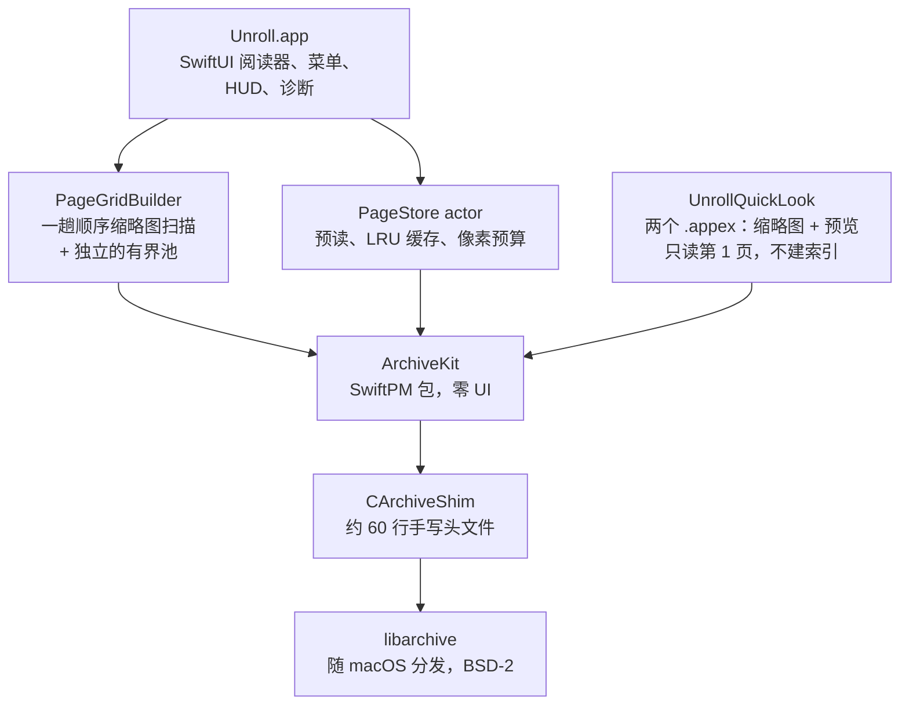

[English](ARCHITECTURE.md) | **简体中文**

# 架构

开卷小到一个下午就能通读一遍，但真正定基调的是少数几个决策。本文件把它们记下来：问题是什么、考虑过哪些替代方案、最后为什么选了这个。这里的数字都是**实测**的，不是估计——完整的测量方法在 [`docs/测试与验证.md`](docs/测试与验证.md)。

## 分层

这个切分不是为了好看。`ArchiveKit` 完全不知道 SwiftUI、AppKit 或阅读器的存在，所以 iOS / iPadOS 版本可以原样复用它——而且它能在**不启动 App** 的前提下单独测试。Quick Look 扩展也是直接走 `ArchiveKit`、**完全绕过 `PageStore`**：`PageStore` 的职责是预读并缓存**相邻**页，而这恰恰是缩略图提供者绝不能做的事。缩略图网格同样绕过 `PageStore`，只是理由相反——它需要**整包扫一遍且不淘汰**，而这正是一个"相邻页缓存"做不到的事（见决策 7）。

| 层 | 职责 | 依赖 |
| --- | --- | --- |
| `Unroll.app` | 视图、菜单、键盘、HUD、最近打开、崩溃诊断 | `PageStore` |
| `PageGridBuilder` | 对整包做一趟顺序扫描并逐页降采样；有界内存池在到顶时**停止**而不是淘汰 | `ArchiveKit` |
| `UnrollQuickLook` | 两个 Quick Look 扩展：在像素预算内读第 1 页，如实报告加密／无法读取 | `ArchiveKit` |
| `PageStore` | 预读（±2 页）、缓存淘汰、解码调度 | `ArchiveKit` |
| `ArchiveKit` | 格式识别、自然排序、顺序读页 | `CArchiveShim` |
| `CArchiveShim` | 桥接 macOS SDK 不导出的 `archive.h` | `libarchive` |

---

## 决策 1 —— 用系统自带的 `libarchive`，不打包第三方库

**问题。** 阅读器得应付 ZIP、7z、TAR、RAR。四种都不是省事的格式，其中最麻烦的 7z（固实压缩 + LZMA2）本身就是一个独立项目。

**考虑过的替代方案。** `ZIPFoundation` 只覆盖 ZIP。`SWCompression` 是纯 Swift、覆盖面更广，但更慢，而且不支持 RAR。`XADMaster` 是 GPL 且实际上已无人维护。自己写第四套解压器从来不在选项里。

**最后选的。** macOS 里**已经装好的那个** `libarchive`。BSD-2 许可，覆盖范围内的全部格式；又因为它是操作系统的一部分，在二进制体积和供应链攻击面上都是**零成本**。

**代价，以及怎么处理。** Apple 的 SDK 不导出 `archive.h`。项目没有选择打包一份库，而是自己维护一个约 60 行的头文件（`CArchiveShim`），**只声明真正用到的那些函数**。这样依赖仍然停留在"我们本来就要求的那套系统"上，同时对自己到底调用了什么保持诚实。

**值得知道的连带后果。** 行为跟着**系统库**的版本走，不跟我们的。下面加密处理那一段就是直接例子：加密 7z 根本解不开，因为系统那份 `libarchive` 不支持。App 的做法是把这件事**明说**，而不是弹一个永远不可能成功的密码框。

## 决策 2 —— 单一顺序扫描器，绝不"每页重开一次"

**问题。** 归档格式是**流**，不是随机访问文件。那个显而易见的实现——打开包、跳到第 N 页、读它、关掉——对 ZIP 没事，对固实 7z 是灾难：不解码前面每一页，第 N 页根本无法解码。

**实测。** 在一个 200 页的固实 7z 上，"每页重开"方案到第 150 页时已经**慢 71 倍**，而且这个倍数随包变大继续涨。它对包大小是 O(n²)——也就是说，它恰好在用户最容易察觉的时候变得更糟。

**最后选的。** 一个 `SequentialPageReader` 按顺序把包走一遍，边走边把页交出去。读第 200 页的代价大致等于读第 1 页。

**代价。** 往回翻到已经走过的页，意味着扫描重来。这份代价由下面的缓存来付——而且它严格优于 O(n²)：往回翻的开销被包大小**封顶**，而不是相乘。

**并发约束。** `libarchive` 的 `struct archive` 不是线程安全的，所以每个 reader 实例都是独占的，绝不跨任务共享。这一点是通过"把 reader 做成 actor、不持有共享状态"来强制保证的。

## 决策 3 —— 缓存按**像素**计量，淘汰是**降级**而不是丢弃

**问题。** 一页 4000×6000 的扫描页解码成 RGBA 大约是 96 MB。二十页就是 2 GB——超出机器能匀出来的量，而这在普通阅读中一分钟内就会发生。

**最后选的。** `PageCache` 最多保留 **8 张全分辨率页面**、总计 **2 亿像素**，谁先到算谁。淘汰不是简单丢掉：被淘汰的页会**重新降采样成 1600 px 的缩略图并留下**。这样往回翻几页只需要一次便宜的放大，而不是一次完整解码。

**花过真实调试时间的那个细节。** 对图片解码来说，「已裁剪」不等于「已释放」。`CGImage` 可以在底层缓冲区还活着的时候就被标记为 trimmed——于是**按分配大小量出来的内存看着很正常，`phys_footprint` 却一直在涨**。本项目里每一处内存断言都采 `phys_footprint`，不看分配总量；自动基准正是为此每翻一页采一次。

## 决策 4 —— 开沙盒，但书签在启动时保持"惰性"

**问题。** 在 App Sandbox 下，文件访问权限是**按次**授予的。重启 App 之后，你刚才在看的那个包就又够不到了——那"最近打开"这个功能就不可能存在。

**最后选的。** 安全作用域书签（`bookmarkData(options: .withSecurityScope)`），存进 `UserDefaults`，并声明 `com.apple.security.files.bookmarks.app-scope`。旁边只存**文件名**，**任何路径都不落盘**。

**容易做错的那部分。** 解析书签是**有副作用**的：它可能挂载一个网络卷，也可能弹出一个授权对话框，或者两样都来。如果在**启动时的失效检查**里做这件事，就等于 App 在用户什么都没要求的时候，悄悄去够一台远程服务器——或者把对话框直接糊到用户脸上。

所以两条路径被刻意分开：

| 路径 | 允许做什么 | 何时 |
| --- | --- | --- |
| `unresolvableIDs()` —— 启动期失效探测 | **不挂载、不弹 UI** 地解析。只读：连陈旧书签都不刷新，更不会删除任何东西 | App 启动时，以及打开一个文件之后 |
| `resolve()` —— 真正打开某个条目 | 可以挂载、可以弹窗。这没问题：用户刚点了它 | 点击时 |

因此探测失败是**告知性**的，绝不是破坏性的：菜单项会被**标注**成「文件找不到」，但要等用户真的点了它、打开失败了才处理。探测把「这看起来坏了」和「把它删掉」分开，这也正是两者能被独立测试的原因。

## 决策 5 —— 诊断信息在设计上就不可能泄漏路径

**问题。** App 意外退出时，全世界只有用户一个人知道。一份有用的 bug 报告需要足够的上下文，而一个归档看图器的上下文就是**文件名**——对漫画包来说，文件名常常就是内容本身。

**约束。** 零后端。零自动上传。零运营成本。而且 App 根本没有网络权限——所以「不上传」不是一句政策承诺，而是沙盒层面上的**不可能**。

**最后选的。** 一个面包屑环形缓冲（20 条，实时追加到 JSON Lines 文件，超过 4 KB 截尾）＋ 一个异常退出自检。下次启动时**只问一次**；用户同意的话，App 在浏览器里打开一份**预填好的 GitHub issue 草稿**。App 自身依然不发任何网络请求——发请求的是浏览器，而且用户在提交前可以读完、改完每一个字。

**隐私保障是结构性的，不是过滤出来的。** 最容易想到的做法是"先记日志，事后把路径抹掉"。那是**黑名单**，而黑名单必然会漏：只要漏掉一个分支，一个文件名就跑出去了。这里的做法是把面包屑的**值**在写入时就按白名单校验——`[A-Za-z0-9_-:]{1,24}`。一个路径根本无法用这个字母表表示，所以它**进不来**，无论有没有人记得去过滤。真正被记下来的是分桶值和错误码：页码区间桶、版式模式、翻页方向、适配模式、错误种类。**永远不会有文件名。**

---

## 决策 6 —— 两个 Quick Look 扩展：共享源码，而不是共享框架

**问题。** 一个只有打开之后才现身的归档看图器，在访达里是隐形的。杠杆最大的那个"被看见"特性，就是让包**自己的封面**成为文件图标、并在按空格键的预览里显示——不用启动 App、不建库、不用导入。

**约束。** macOS 规定一个 `.appex` **只能声明一个**扩展点。缩略图（`com.apple.quicklook.thumbnail`）和预览（`com.apple.quicklook.preview`）是两个不同的扩展点，所以**两个 target 是强制的**——不存在"单扩展"的设计。

**最后选的。** 两个 appex target，都嵌在 `Contents/PlugIns/` 下，都在 App 本体之前从内到外签名。读页逻辑放在 `UnrollQuickLook/Shared/`，**编译进两个 target**，而不是抽成一个共享框架——几百字节的重复，比多一个要签名、要管版本、要验证的二进制划算。

**扩展内部有三个决策，比接线本身更重要：**

- **只读第 1 页，不建索引。** 访达为一个窗口的文件会调用缩略图提供者几十次。任何类似"扫一遍整包"的做法都出局；阅读器用的那个单实例流式扫描器 `SequentialPageReader` 在这里**刻意不用**——它是为连续翻页造的，不是为一次性读取造的。
- **出口处加像素预算。** 扫描版的第一页可能是 4000×6000。为了画一个访达图标就整尺寸解码，等于每个文件浪费几十 MB；所以解码走 ImageIO 的缩略图通道，并且**应用 EXIF 变换**——否则用手机照片拼的"漫画"是横躺着的。
- **失败时故意返回「什么都没有」。** 结果是三态枚举（`page` / `encrypted` / `unreadable`），而缩略图提供者在两种失败态下都回 `(nil, nil)`。这是 Quick Look 合法的「本扩展不产出缩略图」信号，访达会退回它自己的通用图标。曾经考虑过给每个加密包画一把锁再打上标记，被否掉了：它携带的信息比默认图标还少，还会让一个好端端的包看起来是坏的。加密与损坏的区别，放在用户明确要求过的**预览面板**里讲。

只声明 `cbz / cbr / cb7 / cbt`。裸 `.zip` 被刻意排除，尽管 App 读得动它：声明了就等于把系统里每一个普通 ZIP 都送进一个漫画阅读器，而其中大多数只会得到「无法预览」。

## 决策 7 —— 缩略图网格**故意**把决策 3 的淘汰策略反了过来

**问题。** App 原有的每一个导航快捷键，都**预设读者知道自己要去哪**：`⌥⌘G` 要一个页码，`⌘D` 标记一页，`⇧⌘↑↓` 去首尾。想找"中间某一处的那张跨页"，只能一路翻过去、靠眼睛认。网格是第一个回答了这个问题的功能。

**为什么显而易见的实现是平方级的。** 网格是**随机**访问的用法——先滚到末尾，再滚回开头。但 `SequentialPageReader` 只能往前走（决策 2）：读第 *k* 页意味着关掉句柄、重新打开、走过 *k* 个 header。所以"滚到哪生成到哪"会把一次网格浏览变成 **O(n²)**——正是决策 2 要躲开的那个陷阱，只是从另一个方向撞了上来。

**最后选的。**

| 选择 | 理由 |
| --- | --- |
| **一趟顺序扫描**，按文档顺序 | 无论用户怎么滚，总代价都被钉死在 O(n)。代价是：某一页**何时**变得可见，由扫描进度决定，而不是由滚动决定 |
| **到预算就停止生成，不淘汰** | 这是对决策 3 的**刻意反转**。淘汰一张网格缩略图，意味着用户滚回来的某一页需要一次随机访问重取——正是刚被顺序扫描消灭掉的平方级开销。在到顶处停下没有坏分支；**悄悄劣化才有** |
| **第三个独立内存池** | 网格缩略图（长边 256 px）和 `PageCache` 降级出来的缩略图（1600 px）差一个数量级。共用一个预算，会互相饿死。常量在 `DesignSystem.PageBudget` |
| **渲染路径不做 I/O** | 视图只查池子。滚动永远不可能把一次磁盘读取拽进绘制流程 |

**为什么决策 3 的策略对 `PageCache` 仍然是对的。** 这两个缓存的差别来自它们的**访问模式**不同，不是其中一个写错了。`PageCache` 服务的是上一页／下一页——近似线性地走，丢掉一页、几页之后重新读回来，代价便宜且有界。网格服务的是**整包随机访问**，任何一次淘汰都可能在任意时刻换来一次全量重扫。同一栋楼，相反的规矩；**规矩得跟着访问模式走**。

**值得记住的那个细节。** 扫描线程是在锁保护下**同步**把缩略图写进池子的，而不是每张图跳回主 actor 一次。第一版设计给每一页都开了一个任务——既凭空造出 N 个任务，又留下一个时间窗：构建已经**上报完成**、池子却还是空的（用户看到的就是「进度条到头了，图还没出来」）。而因为写方现在不在主 actor 上，代次隔离就不再能靠一个标志位了：**每一代都有自己的池子对象**，于是上一包扫描的迟到写入会落进一个没人读的池子。

**关于验证的诚实说明。** 算法层和视图模型层有 20 个单元测试覆盖，其中包括两条失败分类规则（加密页算**跳过**、不算损坏；解码失败**不**重开扫描器，而字节读取失败**必须**重开）。**面板在真实窗口里长什么样，没有任何自动化证据**——打开它需要按 `⇧⌘G`，而注入按键会撞上辅助功能的 TCC 边界。它被列为已知缺口，而不是被描述成"已验证"。

---

## 明确不做的事

一个架构有一部分是由它**拒绝**的东西定义的。下面每一条都是**考虑过并否掉**的，不是漏掉的：

| 不做 | 理由 |
| --- | --- |
| 资料库 / 封面墙 / 元数据 | 那是 YACReader 的地盘。做了就等于用「轻量」这个定位，去换一套别处已经解决的问题域 |
| **7z** 的密码输入，以及任何密码**本** | 系统那份 `libarchive` 根本解不开 7z——给不给密码，回来的都是同一个失败，所以那个框永远不可能成功。7z 得到的是**说明**而不是输入框。ZIP（ZipCrypto / AES）和 RAR **是**有入口的（v1.1 加入，`⇧⌘K`，外加每张加密占位卡上的按钮）；口令**只驻留内存**，绝不写盘 |
| L1/L2 崩溃上报（Sentry、自建、静默上传） | 与「零运营成本」不兼容，也和一个**设计上就没有网络权限**的 App 不兼容 |
| 自己写 `signal` 处理器抓崩溃 | 脆弱；相对于"把崩溃变得更糟"的风险，它比异常退出自检多出来的收益很小 |
| 把归档解压到磁盘 | 这是整个项目的前提。**解压正是这个 App 存在的意义所要避免的事** |
| iOS / iPadOS 版本（v1） | 那是第二个产品，不是一次移植。`ArchiveKit` 被刻意保持无 UI，正是为了让这件事以后仍然可行，而不必重写 |
| 在 Quick Look 预览面板里翻页 | 那等于在一个不接受键盘事件、而且会被宿主按超时收回的面板里重造一个阅读器。预览只显示封面和页数；阅读留在 App 里 |
| 给加密／无法读取的包做占位缩略图 | 给每个加密包画一把锁，携带的信息比访达的默认图标还少，还暗示是这个包本身有问题。**退回到系统图标才是诚实的答案** |

## 测试形态

测试套件按"跑起来需要什么"来切，好让快的反馈一直快：

| Target | 需要启动 App？ | 数量 | 覆盖 |
| --- | --- | --- | --- |
| `ArchiveKit`（SwiftPM） | 否 | 70 | 格式处理、自然排序、顺序读取、完整性扫描、逐字节 fixture 比对 |
| `UnrollLogicTests` | 否 | 6 | 阅读器对 `ArchiveKit` 的契约，毫秒级跑完 |
| `UnrollQuickLookTests` | 否 | 11 | Quick Look 扩展的读页逻辑：首页选取、降采样上限、以及完整的失败态映射 |
| `UnrollTests`（宿主为 App） | 是 | 187 | 视图模型逻辑、版式／方向、进度与书签持久化、最近打开、本地化 key、菜单与快捷键守卫、缩略图网格的扫描与预算规则，以及**内存预算的不变量本身** |

截至 2026-09-20：**274 用例 / 272 通过 / 2 skip**（两个 skip 是外部样本与合成基准用例，都需要手动开启）。计数按用例名去重——原始日志每个用例会打两行。

有一条边界值得明说，因为它是一个**真实缺口而非疏漏**：扩展的**逻辑**在上面已被覆盖，但**系统到底会不会调用它们**无法无头验证——`.appex` 由 Quick Look 按需拉起，而在受限环境里连 `pluginkit -m` 都被拒、`qlmanage` 也跑不起来。**能自动检查的是静态正确性**（扩展点、架构、嵌套签名、声明的 UTI）。端到端那一步交给 `Scripts/verify-quicklook.sh`，必须在正常的登录会话里跑。

面向读者的 UI 另有一条自动通道。`Scripts/verify-ui.sh` 通过一个**仅 DEBUG 编译的 App 内驱动**来操作窗口——因为本该用来打开那两个面板的快捷键（`⇧⌘G` / `⌥⌘G`）无法从外部注入，辅助功能 TCC 拒绝合成按键。驱动会写下结构化状态行，并配一张截图，于是判据是刻意做成双层的：**日志证数据、截图证版式**，只取任何一层都会放过一整类错误。这条通道跑在 **Debug 构建**上，而不是发布产物。

fixture 由脚本生成、是确定性的、并且已入库——所以「逐字节页比对」意味着每台机器上都是同样的字节。重新生成它们 = 跑一次脚本 + 跑一次测试；见 [`docs/测试与验证.md`](docs/测试与验证.md)。
