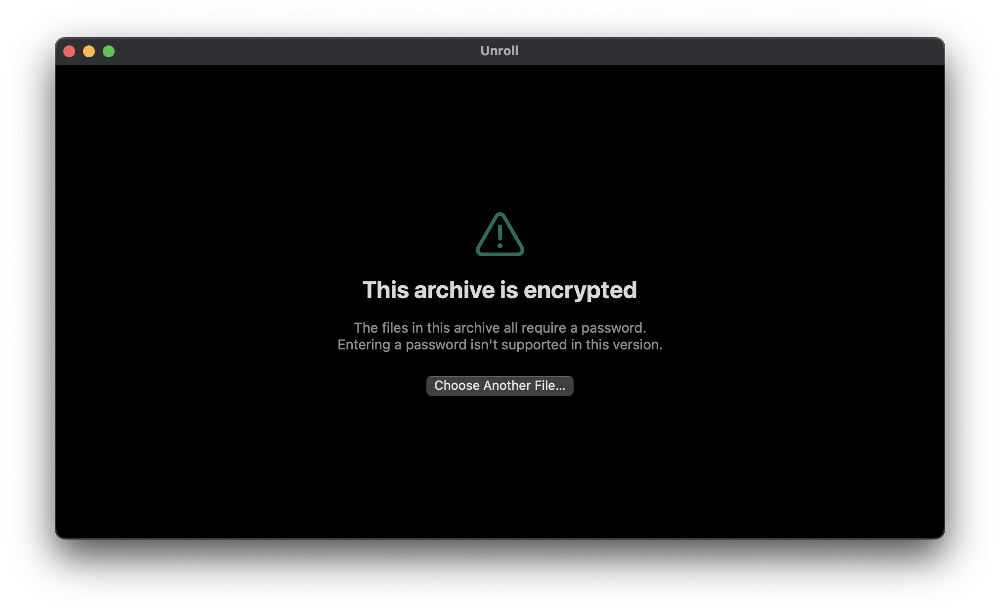

**English** | [简体中文](README.zh-CN.md)

[](https://github.com/GFredR/Unroll/actions/workflows/test.yml)
[](LICENSE)

# Unroll / 开卷

A lightweight, native **macOS comic archive reader**. Double-click a `.cbz / .cbr / .cb7 / .cbt` file and start reading — no extraction, no library, no traces left behind. **Fully open source and free.**

Reading a comic shouldn't require unpacking it first. Most archive tools make you extract to a temp folder, then open an image viewer, and then clean up afterwards — for a 500 MB archive that's half a gigabyte of disk churn just to read page 1. Unroll streams pages straight out of the archive instead.

## Demo


*Cover → single page → two-page spread, recorded straight from the app in full screen. The pages are generated placeholders, not a real comic.*

## Features

- **Reads straight from the archive** — nothing is ever extracted to disk, no thumbnail database is built, no "library" is imported. Open a file, read it, quit.
- **Zero third-party dependencies** — it uses the `libarchive` (BSD-2) that already ships with macOS. The whole app is about 1.9 MB: a 1.3 MB main binary plus roughly 0.5 MB for the two Finder extensions.
- **A single sequential scanner** — pages are pulled through one streaming pass, so page 200 costs about the same as page 1. The naive alternative (reopening the archive per page) degrades quadratically on solid 7z archives: measured **71× slower** at 150 pages, and getting worse as the archive grows.
- **Page cache with a pixel budget** — at most 8 full-resolution pages and 200 M pixels are kept in memory, and the thumbnail pool has its own 20 M pixel budget on top of its count cap. Evicted pages are demoted to a 1600 px thumbnail rather than dropped outright, so scrubbing back is instant instead of a re-decode.
- **Single page & two-page spreads, including right-to-left (manga)** — spreads advance two pages at a time; flipping the reading direction only mirrors the spread and never moves your position. **Cover on its own page** (`⌥⌘C`) matches how a manga volume is actually bound: the cover stands alone, then 1-2 / 3-4 pair up. Off by default, since not every cbz is laid out as a bound volume.
- **Quick Look integration** — press `Space` on an archive in Finder to see its cover and page count without opening the app, and let Finder show the actual cover as the file icon instead of a generic archive glyph. It ships as **two** bundled extensions (thumbnail + preview), because macOS allows exactly one extension point per `.appex`. Encrypted or unreadable archives deliberately fall back to the system icon rather than a misleading placeholder. Only `cbz / cbr / cb7 / cbt` are claimed — plain `.zip` is left alone, so ordinary ZIP files never route through Unroll.
- **Keyboard-first** — every action is reachable without touching the mouse.
- **HUD overlay** — filename, page number and a progress bar; fades out 2.5 s after you stop moving.
- **Recent documents** — the last 10 archives, remembered with security-scoped bookmarks so the sandbox can reopen them. The menu lists file names only, and shows how far you got in each one.
- **Resume where you left off** — per archive, it remembers the page, single/two-page layout, reading direction and zoom mode. Identity is "file name + file size", so no path is ever stored.
- **Bookmarks** — `⌘D` marks the current page, `⌥⌘↑` / `⌥⌘↓` jump between bookmarks (wrapping at the ends), and the Bookmarks menu jumps straight to any marked page.
- **Four zoom modes** — fit window / fit width / fit height / actual size (`⌘3`–`⌘6`), with pinch and double-click zoom layered on top.
- **Go to page** — `⌥⌘G` jumps to a page number.
- **Save the current page as an image** (`⌘S`) — writes it out as PNG or JPEG. In two-page mode you get **the whole spread as you see it** (side by side, in your reading direction), not one isolated page.
- **A draggable progress bar** — the HUD bar scrubs: the page number follows your drag, and it only jumps when you let go (instead of decoding a page for every step).
- **Page number in the window title** — the title bar reads "file name · P.3/200", so multiple windows and Dock hover tell you where you are. `⇧⌘F` reveals the current file in Finder when you want to move on to the next volume.
- **Encrypted archives can be unlocked with a password** — an encrypted cbz / cbr opens straight into a password prompt, and the correct password gets you reading. For partially encrypted archives, `⇧⌘K` unlocks the locked pages mid-read. The password lives in memory only: never written to disk, never remembered, never in a report. Formats the system library genuinely cannot decrypt (encrypted 7z) get no prompt at all — they get an honest explanation. See below.
- **Check an archive's integrity** (`⌥⌘V`) — verifies every page's bytes and **names the page numbers that fail**, instead of leaving you to discover them by reading. An archive whose directory is intact but whose page data is damaged is the most common kind of corruption, and "it opened" does not mean "it's sound". Read-only, no decoding pass, and it never reports "stopped early" as "all clear".
- **Opening a large archive never freezes the app** — listing the archive runs off the main thread and is cancellable, so a network volume or a several-thousand-page archive no longer blocks the window (and switching archives takes effect immediately instead of waiting for the previous read to finish).
- **Native SwiftUI, macOS 14+, sandboxed, and with no network permission at all.**

## Measured performance

The numbers below come from a benchmark that drives the real page pipeline through a 200-page archive and samples `phys_footprint` after every page ([`UnrollTests/BigSampleBenchTests.swift`](UnrollTests/BigSampleBenchTests.swift)), so they measure the shipping path rather than a synthetic loop:

| Archive | Pages | Peak memory | Per page |
| --- | --- | --- | --- |
| `.cbz` (ZIP) | 200 | **0.15 GB** | 2.6 ms |
| `.cb7` (solid 7z) | 200 | **0.06 GB** | 2.4 ms |

Sitting on page 1 of a **437 MB** archive, the shipped app holds **183 MB** resident. The app is **1.9 MB** on disk (a 1.3 MB main binary plus ~0.5 MB for the two Quick Look extensions), and the DMG is **812 KB**.

The number worth reading twice is the one behind the sequential scanner. Reopening the archive for each page — the obvious way to build this — is **71× slower** by page 150 on a solid 7z archive, and the gap widens as the archive grows, because solid compression means every page drags the ones before it. That is why pages are pulled through a single streaming pass instead.

## Supported formats

| Extension | Container | Status |
| --- | --- | --- |
| `.cbz` / `.zip` | ZIP | ✅ verified with fixtures |
| `.cb7` / `.7z` | 7z, including solid archives | ✅ verified with fixtures |
| `.cbt` / `.tar` | TAR | ✅ verified with fixtures |
| `.cbr` | RAR 5 | ✅ **verified against real-world samples** |
| `.cbr` | RAR 4 (older archives) | ⚠️ untested — no sample on hand; `libarchive` supports RAR 4, so it should work, but it has not been confirmed |
| any | encrypted | ✅ detected; **ZIP (ZipCrypto / AES-256) and RAR can be unlocked with a password**; encrypted 7z can't be decrypted by the system library, and says so |
| any | header-encrypted | ⚠️ even the file listing is encrypted, so nothing can be read — explained honestly, with a next step |

When an archive holds no images, or the file is damaged or isn't an archive at all, you get a specific message rather than an empty window.

## Encrypted archives



An encrypted cbz (or any ZIP / RAR-based archive) opens straight into a password prompt. The right password starts reading immediately; a wrong one **keeps you right there and says why** (case-sensitive — watch the input method and stray spaces), so you just try again instead of being bounced back to an error page.

There are three distinct cases, and they are handled differently because the underlying truth is different:

- **Header-encrypted** — even the file listing is encrypted, so the archive can't be opened at all. That is stated directly and no prompt is offered, because a prompt would be pointless: until you know what's inside, there is nothing to decrypt.
- **Fully encrypted** — the contents are encrypted and the system library *can* decrypt them (ZipCrypto and AES-256 ZIP both verified), so you get a password prompt.
- **Partially encrypted** — only some pages are locked. Those pages get an "encrypted" placeholder card while the rest stay readable; one password via `⇧⌘K` (or the button on the card) unlocks them all **without moving where you are in the book**. An archive with two locked pages is still worth opening.

One case deserves special mention: for **encrypted 7z**, the system `libarchive` cannot decrypt content *at all* — not even with the correct password. That is a limitation of the library macOS ships, not a policy choice by this app. So no password box is offered here on purpose: asking you for a password that cannot possibly work would disguise a library limitation as a problem with your input, which is worse than plainly saying it isn't supported. Encrypted RAR does get a prompt — but the wording is deliberately weaker than for 7z, because there is no RAR encryption sample on hand to test against, so the evidence isn't the same. If it really can't be opened, it lands on the same "this archive can't be unlocked" message.

**About the password itself:** it exists in memory only, for the duration of that one reading session, and is gone when you quit. Unroll does **not** remember passwords (that would mean the Keychain, a separate decision of its own) and never writes one to disk or to a crash report — the report records only the two facts that a password was required and whether the attempt succeeded.

## Install

**Requires macOS 14 Sonoma or later.**

Download `Unroll-<version>.dmg` from [Releases](https://github.com/GFredR/Unroll/releases), open it, and drag `Unroll.app` into **Applications**.

The build is ad-hoc signed (no paid Apple Developer account), so macOS Gatekeeper may block the first launch. Either of these works:

```bash
xattr -dr com.apple.quarantine /Applications/Unroll.app
```

or **right-click** `Unroll.app` → **Open** → confirm.

**Checking the download.** With no paid signature, the `SHA256` next to each release is the only integrity credential — it can tell you the file was not tampered with, but not which source it came from. The app records that itself, so you can close the loop without trusting anyone:

```bash
shasum -a 256 -c Unroll-<version>.dmg.sha256        # 1. the file is intact
/usr/libexec/PlistBuddy -c 'Print :UnrollSourceCommit' \
  "/Volumes/Unroll <version>/Unroll.app/Contents/Info.plist"   # 2. built from this commit
```

Compare the commit it prints with the repository. This works the same way for the installed copy: `PlistBuddy` against `/Applications/Unroll.app/Contents/Info.plist`.

Once installed, `.cbz / .cbr / .cb7 / .cbt` files open in Unroll on double-click. Plain `.zip` is only offered inside the Open panel — Unroll never takes over the system's default handler for ZIP.

The two Quick Look extensions live inside the app bundle and are picked up automatically once `Unroll.app` is in **Applications**. If pressing `Space` still shows a generic icon instead of a cover, open **System Settings → General → Login Items & Extensions → Quick Look** and make sure Unroll is switched on. To diagnose it stage by stage, run:

```bash
./Scripts/verify-quicklook.sh --install
```

(it checks the bundle, the nested signatures, PlugInKit registration, and finally asks the system to render a real thumbnail — and only works in a normal terminal, not inside a sandboxed environment).

## Build & run

Requirements: the latest Xcode and [xcodegen](https://github.com/yonaskolb/XcodeGen) (`brew install xcodegen`).

```bash
# 1. Generate the Xcode project (project.yml is the single source of truth;
#    re-run it after changing that file — the generated project is not committed)
./Scripts/regen.sh

# 2. Open and run (scheme: Unroll)
open Unroll.xcodeproj

# 3. Logic-only tests: no app launch, milliseconds
cd ArchiveKit && swift test
```

To produce a distributable build (Universal 2: arm64 + x86_64) and a DMG:

```bash
./Scripts/build-app.sh     # → ../Unroll-dist/Unroll.app
./Scripts/make-dmg.sh      # → ../Unroll-dist/Unroll-<version>.dmg
```

Both scripts write outside the repository on purpose — keeping `.app`, `.dmg` and DerivedData out of the source tree keeps Xcode and Spotlight from crawling them on every open.

## Keyboard shortcuts

| Shortcut | Action |
| --- | --- |
| `⌘O` | Open… |
| `⌘1` / `⌘2` | Single page / two-page spread |
| `⌥⌘C` | Cover on its own page (spread pairing) |
| `⇧⌘L` / `⇧⌘R` | Left-to-right / right-to-left (manga) |
| `⇧⌘↑` | Back to cover |
| `⇧⌘↓` | Jump to last page |
| `⌥⌘G` | Go to page… |
| `⌘S` | Save the current page as an image (whole spread in two-page mode) |
| `⇧⌘F` | Reveal the current file in Finder |
| `⇧⌘K` | Enter the archive's password to unlock encrypted pages (available when the current archive has any) |
| `⌥⌘V` | Check the archive's integrity (reports which page is broken; read-only) |
| `⌘3` / `⌘4` / `⌘5` / `⌘6` | Fit window / fit width / fit height / actual size (1:1) |
| `⌘D` | Add / remove a bookmark on the current page |
| `⌥⌘↑` / `⌥⌘↓` | Previous / next bookmark (wraps at the ends) |
| `←` / `→` | Previous / next page — follows the reading direction |
| `Space` `↓` `Page Down` `End` | Next page |
| `Page Up` `Home` | Previous page |
| Click left / right half of the window | Previous / next page (mirrored in right-to-left mode) |
| Double-click | Toggle 1× ⇄ 2× zoom |
| Pinch | Zoom continuously between 1× and 8× |
| Scroll wheel / trackpad | Page through the archive while unzoomed; zooms out of the way once magnified |

## Privacy

This app has **no network entitlement**, so the sandbox makes network access impossible rather than merely unused. There is no telemetry, no analytics, no account, and no "anonymous usage data".

Crash reporting is **opt-in and manual**. If the app was killed or quit abnormally, the next launch asks once whether you want to file a bug report — and the app still makes no network request: it hands a pre-filled GitHub issue draft to your browser, where you can read and edit everything before deciding to submit. The draft contains the version, OS, architecture, archive format, page counts and a short breadcrumb trail of what the reader was doing. It contains **no file names and no paths** — breadcrumb values are restricted by construction to a small character set, so a path cannot leak into them even by accident.

## Known limitations

- **Encrypted 7z cannot be read** — the system `libarchive` can't decrypt 7z, even with the correct password. So it offers no password box and says so instead. Separately: **encrypted RAR does get a prompt but is untested** (no RAR encryption sample on hand, and none can be produced on this machine); if it can't be opened, it reports "this archive can't be unlocked".
- **RAR 4 is unverified** — RAR 5 has been tested against real samples; RAR 4 has not.
- **Very large solid 7z archives** cost roughly 90 ms of LZMA2 decompression per page. Prefetching is designed to hide that, but jumping far ahead in a huge solid archive has a real, visible cost.
- **Resume and bookmarks identify an archive by "file name + file size"** — rename the file, or change its contents so the size differs, and it counts as a different archive: your progress and bookmarks stay behind. That is the price of never storing a path.
- **The integrity check (⌥⌘V) verifies bytes, not pixels** — it uses the checksums the archive format itself carries, so it finds data corruption but does not decode every image. That is deliberate: adding a decode pass would turn 200 pages from a moment into minutes, and a failed decode only means "this app can't read it", not "the file is broken". Encrypted pages are skipped rather than reported as damage.
- **Not notarized** — ad-hoc signing only, hence the first-launch Gatekeeper step above. This applies to the bundled Quick Look extensions too: if `Space` does nothing on another machine, they are the first thing to suspect (macOS is stricter about loading third-party extensions than about launching an app). `Scripts/verify-quicklook.sh` reports exactly which stage fails.
- **Quick Look previews show the first page only.** No paging inside the preview panel — that would mean rebuilding the reader inside a panel that doesn't take keyboard input. Reading still happens in the app.
- **macOS only in v1.** The archive engine is kept as a standalone SwiftPM package (`ArchiveKit`) specifically so an iOS / iPadOS build can reuse it later.

## Project layout

```
Unroll/
├── Unroll/
│   ├── App/        # Entry point, menus, app lifecycle
│   ├── Features/   # Reader: view, view model, HUD
│   ├── Core/       # Page store & cache, design system, recents, diagnostics
│   └── Resources/  # en / zh-Hans strings, asset catalog
├── ArchiveKit/     # Local SwiftPM package — archive reading, zero UI (reusable)
├── UnrollQuickLook/        # Two Quick Look extensions: Thumbnail/ + Preview/, Shared/ page reader
├── UnrollTests/            # App-hosted unit tests
├── UnrollLogicTests/       # Fast logic-only tests
├── UnrollQuickLookTests/   # Tests for the extensions' shared page-reading logic
├── Scripts/        # regen / build-app / make-dmg / verify-quicklook / demo sample / GIF recording
└── project.yml     # xcodegen source of truth
```

The reasoning behind these boundaries — and the decisions that shaped them — is in [ARCHITECTURE.md](ARCHITECTURE.md).

## Support this project

Unroll is **fully open source and free.** If it saved you some time or a subscription, buy me a coffee:

1. Scan the QR code below with WeChat.
2. Any amount is welcome — it's the thought that counts.


## License

MIT — see [LICENSE](LICENSE). Use, modify, and redistribute freely, for personal or commercial projects.
