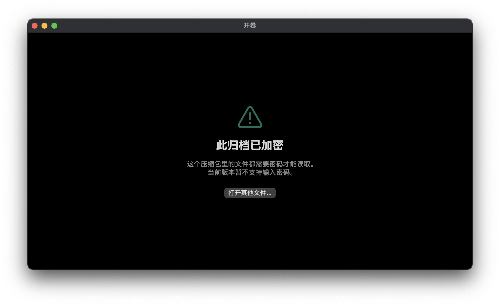

[English](README.md) | **简体中文**

[](https://github.com/GFredR/Unroll/actions/workflows/test.yml)
[](LICENSE)

# 开卷 / Unroll

轻量的原生 **macOS 归档看图器**。双击 `.cbz / .cbr / .cb7 / .cbt` 文件直接开始阅读——不解压、不建库、退出无痕。**完全开源免费。**

看漫画不该先解压一遍。多数解压工具要你先解到临时目录，再用看图软件打开，看完还要清理——一个 500MB 的包，为了看第 1 页就得折腾半个 G 的磁盘读写。开卷的做法是直接把页面从归档里流式读出来。

## 演示


*封面 → 单页 → 双页跨页，全屏状态下直接从 App 里录的。页面是脚本生成的占位素材，不是真实漫画。*

## 特性

- **直接从归档里读**——任何内容都不会被解压到磁盘，不建缩略图数据库，不导入"资料库"。打开文件、阅读、退出，就这么简单。
- **零第三方依赖**——用的是 macOS 自带的 `libarchive`（BSD-2 许可）。整个 App 约 1.9 MB：主程序 1.2 MB，两个 Finder 扩展加起来约 0.5 MB。
- **单实例顺序扫描**——所有页面走一遍流式扫描，第 200 页的代价与第 1 页基本相同。反面做法（每页重新打开一次归档）在 solid 7z 上是平方级退化：实测 150 页时慢 **71 倍**，且包越大越糟。
- **带像素预算的页缓存**——内存里最多保留 8 页全分辨率图、总计不超过 2 亿像素；缩略图池除张数上限外，另有一份 2000 万像素的预算。被淘汰的页先降级成 1600px 缩略图而不是直接丢掉，所以往回翻是瞬间出图，不需要重新解码。
- **单页 / 双页对开，含日漫右开**——对开模式一次前进两页；切换左右开只改变视觉镜像，不会让你的阅读位置跳掉。**封面单独一页**（`⌥⌘C`）对应日式单行本的排版：封面自己一屏，之后才是 1-2 / 3-4 的对开；默认关闭，因为并非每个 cbz 都按单行本排版。
- **Finder 集成（QuickLook）**——在 Finder 里选中归档按空格，不开 App 就能看到封面与总页数；文件图标也直接是封面，不再是通用压缩包图标。因为 macOS 规定一个 `.appex` 只能声明一个扩展点，这里做成**两个**扩展（缩略图 + 预览）。加密或读不出来的归档**刻意退回系统默认图标**，而不是挂一张误导性的占位图。只认 `cbz / cbr / cb7 / cbt`——裸 `.zip` 不碰，普通压缩包不会被路由到开卷。
- **纯键盘可用**——所有操作都不用碰鼠标。
- **HUD 浮层**——显示文件名、页码与进度条，静止 2.5 秒后淡出。
- **最近打开**——保留最近 10 个归档，用 security-scoped bookmark 记住，沙盒下也能重新打开。菜单里只显示文件名。
- **续读记忆**——每本归档记住读到第几页、单双页、左右开与缩放档位，重新打开自动回到原处。记录的身份是「文件名 + 文件大小」，不落路径。
- **书签**——`⌘D` 标记当前页，`⌥⌘↑` / `⌥⌘↓` 在书签之间跳转（到底会绕回），书签菜单里可以直达某一页。
- **缩放四档**——适应窗口 / 适应宽 / 适应高 / 实际大小（`⌘3`–`⌘6`）；捏合与双击的自由缩放叠加在档位之上。
- **页码直达**——`⌥⌘G` 输入页码跳转。
- **当前页另存为图片**（`⌘S`）——把正在看的这一页存成 PNG 或 JPEG；双页模式下导出的是**屏幕上那一整摊**（按当前阅读方向并排），不是孤零零一页。
- **可拖的进度条**——HUD 里的进度条能直接拖：拖动中页码跟着变，松手才跳页（而不是每挪一格就解码一次）。
- **窗口标题带页码**——标题栏显示「文件名 · P.3/200」，多窗口或 Dock 悬停时一眼看出读到哪；`⇧⌘F` 在访达中显示当前文件，接着看下一卷不用重新找。
- **加密归档可输密码解压阅读**——加密的 cbz / cbr 打开时直接给密码输入框，输对即读；部分加密的包在阅读中用 `⇧⌘K` 解锁那些锁住的页。密码只留在内存里，不落盘、不记忆、不进报告。系统库确实解不开的格式（加密 7z）不给这个入口，而是如实说明——详见下文。
- **可以检查归档完整性**（`⌥⌘V`）——逐页验字节，**点名哪几页读不出来**，而不是让你自己翻到那一页才发现。目录完好、某一页数据坏掉是最常见的损坏形态，而"能打开"并不等于"文件是好的"。只读、不解码图片；而且**绝不把"提前停下"说成"全部正常"**。
- **打开大归档不会假死**——列目录在主线程之外，且可以取消。网络卷上或几千页的包不会再让窗口转圈；换书也立刻生效，不必等上一个包读完。
- **原生 SwiftUI、macOS 14+、开启沙盒、且完全没有网络权限。**

## 实测性能

下面的数字来自一个**驱动真实翻页管线**的基准（[`UnrollTests/BigSampleBenchTests.swift`](UnrollTests/BigSampleBenchTests.swift)）：200 页归档从头翻到尾，每翻一页采一次 `phys_footprint`——量的是发布路径，不是合成循环：

| 归档 | 页数 | 峰值内存 | 每页均耗时 |
| --- | --- | --- | --- |
| `.cbz`（ZIP） | 200 | **0.15 GB** | 2.6 ms |
| `.cb7`（solid 7z） | 200 | **0.06 GB** | 2.4 ms |

打开 **437 MB** 的归档停在第一页，发布版 App 常驻 **183 MB**；App 在磁盘上 **1.9 MB**（主程序 1.2 MB + 两个 QuickLook 扩展约 0.5 MB），DMG **756 KB**。

真正值得多看一眼的是顺序扫描器背后那个数字：**每页重新打开一次归档**——实现这件事最直觉的做法——在 solid 7z 上翻到第 150 页时已经慢 **71 倍**，而且归档越大差距越大，因为 solid 压缩下每一页都得先把前面的解开。所以这里改用**单次流式扫描**。

## 支持的格式

| 扩展名 | 容器 | 状态 |
| --- | --- | --- |
| `.cbz` / `.zip` | ZIP | ✅ 已用 fixture 验证 |
| `.cb7` / `.7z` | 7z（含 solid 块） | ✅ 已用 fixture 验证 |
| `.cbt` / `.tar` | TAR | ✅ 已用 fixture 验证 |
| `.cbr` | RAR 5 | ✅ **已用真实样本验证** |
| `.cbr` | RAR 4（老归档） | ⚠️ 未验证——手头没有样本；`libarchive` 支持 RAR 4，理论上可用，但尚未确认 |
| 任意 | 加密归档 | ✅ 能检测；**ZIP（ZipCrypto / AES-256）与 RAR 可输密码解压阅读**；加密 7z 系统库无解，如实说明 |
| 任意 | 头部加密 | ⚠️ 连文件名列表都被加密，无法读取——如实说明并给出下一步 |

归档里没有图片、文件损坏或根本不是压缩包时，会给出针对性的说明，而不是一个空白窗口。

## 加密归档



加密的 cbz（或任何 ZIP / RAR 类型的归档）打开时就会弹出密码输入框——密码对就直接进阅读，输错**留在原地说清原因**（区分大小写、留意输入法），重试即可，不会退回错误页。

有三种情况，因为底层事实不同，处理方式也不同：

- **头部加密**——连文件列表本身都被加密了，归档根本打不开，所以直接说明这一点，不给密码框（给了也没有意义：在知道里面有什么之前，没有东西可解）。
- **全部加密**——内容被加密且**系统库解得开**（ZIP 的 ZipCrypto 与 AES-256 都实测通过），于是弹密码框。
- **部分加密**——只有部分页面被锁。这些页显示"此页已加密"的占位卡片，其余页面照常可读；用 `⇧⌘K`（或卡片上的按钮）输一次密码，锁住的页会一并解开，**而你正在读的位置不会动**。所以一个只锁了两页的包依然值得打开。

有一种情况要特别说明：**加密的 7z**，系统自带的 `libarchive` **完全无法解密**——即使密码正确也读不出来。这是 macOS 所带库的限制，不是本程序的取舍。所以这里**刻意不给密码输入框**：请你输一个注定无效的密码，是把库的能力边界伪装成你的输入问题，比直接说不支持更糟。加密 RAR 走的是给入口这条路——但**措辞上弱于 7z**，因为 RAR 加密本机没有样本可测，证据强度不一样；真解不开时会落到同一句"这个归档解不开"。

**关于密码本身：** 它只在内存里存在，用于解密当前这次阅读；一旦退出就没了。开卷**不会**记住密码（那需要写钥匙串，是另一个独立决定），也不会把它写进任何文件或崩溃报告——报告里只留"需要过密码"和"成功 / 失败"这两个事实。

## 安装

**需要 macOS 14 Sonoma 或更高版本。**

从 [Releases](https://github.com/GFredR/Unroll/releases) 下载 `Unroll-<版本>.dmg`，打开后把 `Unroll.app` 拖进「应用程序」文件夹。

构建是 ad-hoc 签名（没有付费开发者账号），所以首次打开可能被 Gatekeeper 拦一次。下面两种方式都行：

```bash
xattr -dr com.apple.quarantine /Applications/Unroll.app
```

或者**右键**点 `Unroll.app` → **打开** → 确认。

**核对下载物。** 没有付费签名，每个 Release 旁边的 `SHA256` 就是唯一的完整性凭据 —— 它能说明文件没被改过，但说明不了它来自哪份代码。这件事 App 自己记着，不必信任何人就能对上：

```bash
shasum -a 256 -c Unroll-<版本>.dmg.sha256        # ① 文件完整
/usr/libexec/PlistBuddy -c 'Print :UnrollSourceCommit' \
  "/Volumes/Unroll <版本>/Unroll.app/Contents/Info.plist"   # ② 构建自哪个提交
```

把打印出来的提交号与仓库里同名的那笔一比即可。装好之后同样能查：把路径换成 `/Applications/Unroll.app/Contents/Info.plist`。

装好后，`.cbz / .cbr / .cb7 / .cbt` 双击即用开卷打开。普通 `.zip` 只在「打开」面板里提供——开卷不会抢占系统对 ZIP 的默认关联。

两个 QuickLook 扩展就在 App 包内，把 `Unroll.app` 放进「应用程序」后会自动被系统识别。如果按空格仍然只看到通用图标，去**系统设置 → 通用 → 登录项与扩展 → 快速查看**里确认开卷是打开的。想逐段排查是哪一环断了：

```bash
./Scripts/verify-quicklook.sh --install
```

（它会依次检查包内扩展、嵌套签名、PlugInKit 注册，最后真的让系统渲染一张缩略图。注意：只能在普通终端里跑，受限/沙箱环境里会被脚本自己拦下。）

## 构建与运行

需要最新版 Xcode 与 [xcodegen](https://github.com/yonaskolb/XcodeGen)（`brew install xcodegen`）。

```bash
# 1. 生成 Xcode 工程(project.yml 是唯一真源,改完必须重跑;生成物不入库)
./Scripts/regen.sh

# 2. 打开运行(scheme: Unroll)
open Unroll.xcodeproj

# 3. 纯逻辑测试:不启动 App,毫秒级
cd ArchiveKit && swift test
```

要产出可分发的构建（Universal 2：arm64 + x86_64）与 DMG：

```bash
./Scripts/build-app.sh     # → ../Unroll-dist/Unroll.app
./Scripts/make-dmg.sh      # → ../Unroll-dist/Unroll-<version>.dmg
```

两个脚本都刻意把产物写到仓库之外——把 `.app`、`.dmg` 和 DerivedData 留在源码树里，会让 Xcode 和 Spotlight 每次打开工程都去遍历它们。

## 键盘快捷键

| 快捷键 | 动作 |
| --- | --- |
| `⌘O` | 打开… |
| `⌘1` / `⌘2` | 单页 / 双页对开 |
| `⌥⌘C` | 封面单独一页（双页配对口径） |
| `⇧⌘L` / `⇧⌘R` | 从左往右读 / 从右往左读（日漫） |
| `⇧⌘↑` | 回到封面 |
| `⇧⌘↓` | 跳到末页 |
| `⌥⌘G` | 跳转到指定页 |
| `⌘S` | 当前页另存为图片（双页时导出整摊） |
| `⇧⌘F` | 在访达中显示当前文件 |
| `⇧⌘K` | 输入解压密码，解锁加密页（当前归档有加密页时可用） |
| `⌥⌘V` | 检查归档完整性（点名坏页；只读，不改文件） |
| `⌘3` / `⌘4` / `⌘5` / `⌘6` | 适应窗口 / 适应宽 / 适应高 / 实际大小（1:1） |
| `⌘D` | 标记 / 取消标记当前页 |
| `⌥⌘↑` / `⌥⌘↓` | 上一个 / 下一个书签（到端点绕回） |
| `←` / `→` | 上一页 / 下一页——跟随阅读方向 |
| `空格` `↓` `Page Down` `End` | 下一页 |
| `Page Up` `Home` | 上一页 |
| 点击窗口左半 / 右半 | 上一页 / 下一页（右开模式下镜像反转） |
| 双击 | 1× ⇄ 2× 缩放切换 |
| 捏合 | 在 1×–8× 之间连续缩放 |
| 滚轮 / 触控板 | 未放大时用于翻页；放大后让位给缩放与平移 |

## 隐私

本 App **没有网络权限**——沙盒让联网变成"做不到"，而不只是"没用"。

没有遥测、没有统计、没有账号、没有"匿名使用数据"。

崩溃上报是**自愿且手动**的。如果 App 被强杀或异常退出，下次启动会问一次要不要提交报告——而 App 自身依然不发任何网络请求：它把一份预填好的 GitHub issue 草稿交给你的浏览器，你可以先看、先改，再决定要不要提交。草稿里只有版本、系统、架构、归档格式、页数和一小段阅读器在做什么的操作轨迹。它**不含文件名，也不含路径**——面包屑的取值在结构上就被限制在一个很小的字符集内，路径想混进去也没有出口。

## 已知限制

- **加密 7z 读不了**——系统 `libarchive` 解不开 7z 的加密，给对密码也不行。所以它不给密码输入框，而是直接说明。另外：**加密 RAR 给密码入口，但未实测**（手头没有 RAR 加密样本，本机也造不出来），解不开时会如实报"这个归档解不开"。
- **RAR 4 未验证**——RAR 5 已用真实样本测过，RAR 4 还没测。
- **超大的 solid 7z 包**每页约需 90ms 的 LZMA2 解压。预读机制就是为了把这个代价藏起来，但在巨大的 solid 包里做远距离跳页，代价是真实且肉眼可见的。
- **续读与书签按「文件名 + 文件大小」认档**——把文件改名（或改了内容导致大小变化）后会被当成另一本，进度与书签不会跟过去。这是"只存文件名、不存路径"的代价。
- **完整性检查（⌥⌘V）验的是字节，不是像素**——用归档格式自带的校验值，能发现数据损坏，但不会逐张解码图片。这是刻意的：加一遍解码会让 200 页从秒级变成分钟级，而解码失败只说明"这个软件读不懂"，不说明"文件坏了"。加密页会被跳过，而不是算作损坏。
- **未做公证**——仅 ad-hoc 签名，所以首次打开要走上面那一步绕行。这条同样适用于包内的两个 QuickLook 扩展：如果在别的机器上按空格毫无反应，先怀疑它们（macOS 对"加载第三方扩展"比"启动一个 App"更严）。具体卡在哪一环，`Scripts/verify-quicklook.sh` 会逐项报出来。
- **QuickLook 预览只显示首页**，面板里不能翻页——那等于在一个不吃键盘事件的面板里重造一个阅读器。真正翻页阅读仍然回到 App。
- **v1 仅支持 macOS。** 归档引擎刻意做成独立的 SwiftPM 包（`ArchiveKit`），就是为了以后再出 iOS / iPadOS 版本时能直接复用。

## 工程结构

```
Unroll/
├── Unroll/
│   ├── App/        # 入口、菜单、App 生命周期
│   ├── Features/   # Reader:视图、ViewModel、HUD
│   ├── Core/       # 页存储与缓存、设计系统、最近打开、诊断
│   └── Resources/  # 中英文案、Asset Catalog
├── ArchiveKit/     # 本地 SPM 包——归档读取,不含 UI(可复用)
├── UnrollQuickLook/        # 两个 QuickLook 扩展:Thumbnail/ + Preview/,Shared/ 共用读首页
├── UnrollTests/            # 宿主为 App 的单元测试
├── UnrollLogicTests/       # 纯逻辑快车道测试
├── UnrollQuickLookTests/   # 扩展共享读取逻辑的测试
├── Scripts/        # regen / build-app / make-dmg / verify-quicklook / 演示素材 / GIF 录制
└── project.yml     # xcodegen 唯一真源
```

这些边界划分背后的理由——以及促成它们的那几个决策——见 [ARCHITECTURE.md](ARCHITECTURE.md)。

## 支持这个项目

开卷**完全开源免费**。如果它帮你省下了时间或一笔订阅费，可以请我喝杯咖啡：

1. 用微信扫下面的收款码。
2. 金额随意，心意到了就好。


## 许可

MIT——见 [LICENSE](LICENSE)。可自由使用、修改与再分发，个人或商业项目均可。
